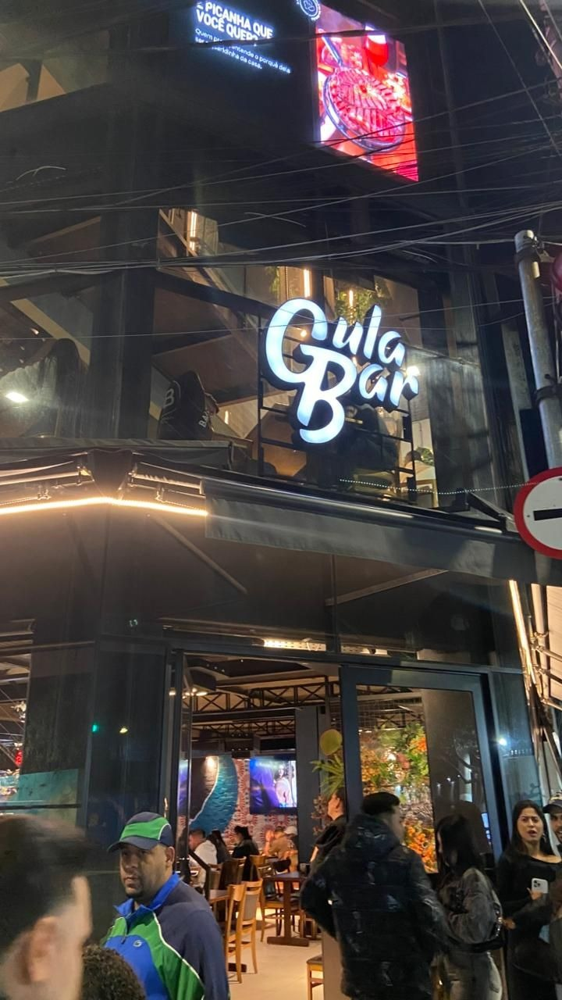
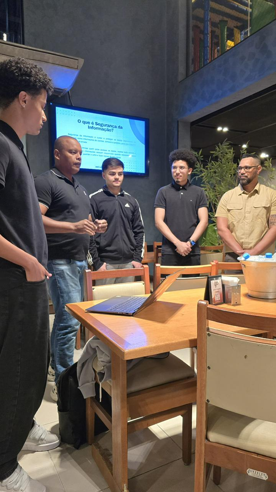
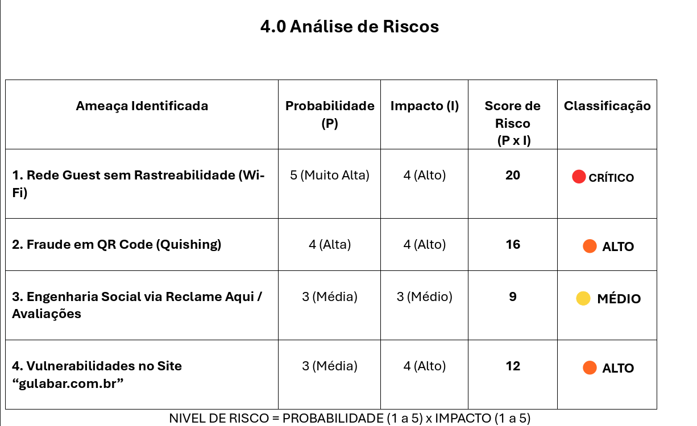

# 🍸 Gula-Bar-SGSI

### Sistema de Gestão de Segurança da Informação baseado na ISO 27001

Projeto prático desenvolvido para aplicação de conceitos de
Segurança da Informação, análise de riscos e implementação
de controles baseados na ISO 27001 em um ambiente de gastrobar.

---

# 🎯 Objetivo

O objetivo deste projeto é simular a implementação de um
SGSI (Sistema de Gestão de Segurança da Informação)
no Gula Bar, realizando:

- Identificação de ativos
- Análise qualitativa de riscos
- Tratamento de riscos
- Definição de controles
- Estruturação de políticas de segurança
- Aplicação de boas práticas de governança

---

# 🛠️ Ferramentas e Metodologias

- ISO 27001
- Gestão de Riscos
- Matriz de Risco
- Análise Qualitativa
- SGSI
- Governança em TI
- Microsoft Word
- Excel

---

# 📂 Estrutura do Projeto

```bash
📁 docs
📁 images
📄 README.md
📄 matriz-de-risco.png
📄 plano-de-tratamento.png
```

---

# 📸 Evidências do Projeto

## Fachada do Gula Bar

Ambiente utilizado como contexto para aplicação prática do projeto de SGSI.



---

## Apresentação do Projeto

Apresentação do SGSI e análise de riscos aplicada ao ambiente do Gula Bar.


---

## Equipe do Projeto

Equipe responsável pela apresentação e desenvolvimento do projeto.



---

# 📊 Matriz de Risco

Análise qualitativa de riscos aplicada ao ambiente do Gula Bar
com base em probabilidade, impacto e classificação de criticidade.



---

## Critérios utilizados

- Probabilidade: escala de 1 a 5
- Impacto: escala de 1 a 5
- Classificação baseada no score final de risco

---

# 📚 Aprendizados

Durante o projeto foram aplicados conceitos como:

- Gestão de riscos
- Classificação de ativos
- Análise de impacto
- Governança em Segurança da Informação
- Controles da ISO 27001
- Documentação técnica
- Segurança organizacional

---

# ✅ Resultado

O projeto permitiu estruturar um modelo inicial de SGSI
para um ambiente corporativo fictício baseado no Gula Bar,
simulando práticas utilizadas em empresas reais.

---

# 👥 Equipe

Projeto desenvolvido em grupo durante atividades práticas
de Segurança da Informação e Governança.

Participantes:
- Vinicius Bibiano
- Geovanni Andrade
- Vagner Lima
- Herbert Yoshino
- Gustavo Rosario

---

# 👨‍💻 Autor

Vinicius Augusto Bibiano

- LinkedIn:
  https://linkedin.com/in/vinicius-augusto-bibiano

- GitHub:
  https://github.com/BibianoVinicius
