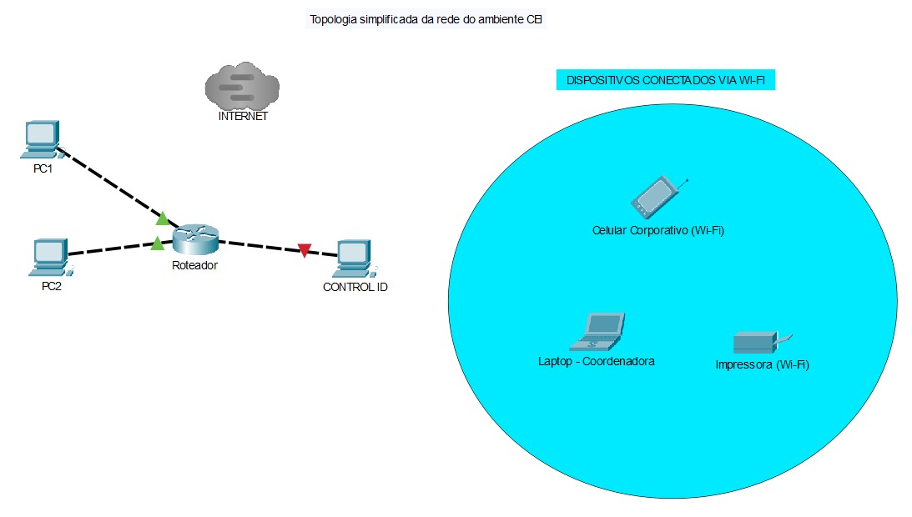
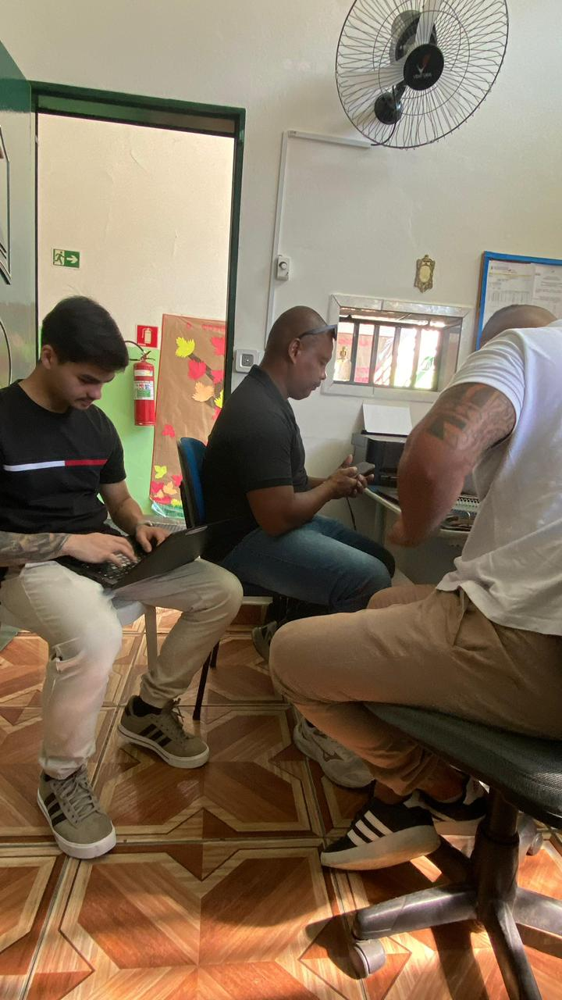
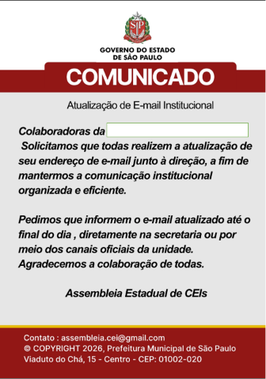

# 🎣 Phishing Awareness Case Study

### Simulação de phishing e conscientização em Segurança da Informação

Projeto prático focado em análise de phishing,
engenharia social e conscientização de usuários,
simulando cenários utilizados em ambientes corporativos.

---

# 🎯 Objetivos

- Identificar ameaças de phishing
- Simular ataques de engenharia social
- Analisar possíveis impactos
- Aplicar medidas defensivas
- Desenvolver conscientização em segurança

---

# 🛠️ Ferramentas Utilizadas

- Kali Linux
- GoPhish
- Linux
- Phishing Analysis
- Social Engineering
- Security Awareness
- Controle de Acesso Control iD

---

# 📂 Estrutura do Projeto

```bash
📁 docs
📁 images
📄 README.md
📄 phishing-analysis.png
📄 awareness-report.png
```

---

# 🌐 Topologia do Ambiente

Mapeamento simplificado da infraestrutura e dispositivos conectados no ambiente analisado.



---

# 📊 Monitoramento e Controle de Acesso

Dashboard do sistema de controle de acesso utilizado durante a análise do ambiente.


---

# 🧪 Análise Técnica do Ambiente

Registro da análise prática e levantamento de vulnerabilidades realizado durante o projeto.



---

# 🎣 Simulação de E-mail Phishing

Exemplo de campanha simulada de engenharia social
utilizando identidade visual institucional para conscientização
sobre ataques de phishing e coleta indevida de informações.



---

## Remetente Utilizado na Simulação

Imagem demonstrando o remetente configurado durante a campanha controlada.


---

# 🚨 Principais Ameaças Identificadas

- Phishing por e-mail
- Engenharia social
- Coleta indevida de credenciais
- URLs maliciosas
- Falta de conscientização de usuários
- Possível comprometimento de contas institucionais

---

# 🛡️ Medidas Defensivas

- Conscientização de usuários
- Treinamento anti-phishing
- Validação de URLs
- MFA (Autenticação Multifator)
- Monitoramento de acessos
- Política de senhas
- Segmentação de rede

---

# 👨‍💻 Minha Participação

- Apoio na análise do cenário de phishing
- Estruturação da documentação
- Participação na simulação controlada
- Identificação de riscos
- Desenvolvimento do relatório técnico
- Levantamento de vulnerabilidades

---

# 📚 Aprendizados

Durante o projeto foram aplicados conceitos como:

- Engenharia social
- Segurança ofensiva controlada
- Conscientização em segurança
- Análise de riscos
- Identificação de ameaças
- Mitigação de ataques
- Segurança corporativa

---

# 👥 Créditos

Projeto desenvolvido em colaboração com:

- Geovanni Andrade
- Gustavo Rosario
- Herbet Yoshino
- Vagner Lima

---

# 👨‍💻 Autor

Vinicius Augusto Bibiano

- LinkedIn:
  https://linkedin.com/in/vinicius-augusto-bibiano

- GitHub:
  https://github.com/BibianoVinicius

